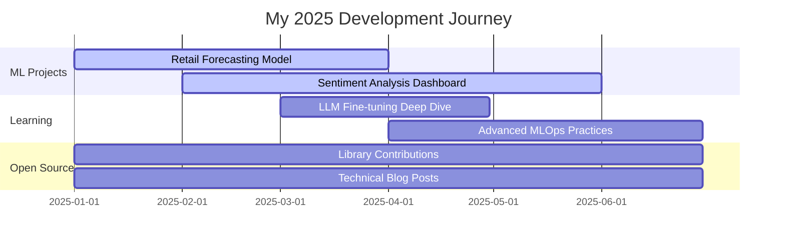

# Welcome to Om Sapkar's Portfolio 

  

  

<pre>
███╗   ██╗███████╗ ██████╗ ███╗   ██╗    ██████╗  ██████╗ ██████╗ ████████╗███████╗ ██████╗ ██╗     ██╗ ██████╗ 
████╗  ██║██╔════╝██╔═══██╗████╗  ██║    ██╔══██╗██╔═══██╗██╔══██╗╚══██╔══╝██╔════╝██╔═══██╗██║     ██║██╔═══██╗
██╔██╗ ██║█████╗  ██║   ██║██╔██╗ ██║    ██████╔╝██║   ██║██████╔╝   ██║   █████╗  ██║   ██║██║     ██║██║   ██║
██║╚██╗██║██╔══╝  ██║   ██║██║╚██╗██║    ██╔═══╝ ██║   ██║██╔══██╗   ██║   ██╔══╝  ██║   ██║██║     ██║██║   ██║
██║ ╚████║███████╗╚██████╔╝██║ ╚████║    ██║     ╚██████╔╝██║  ██║   ██║   ██║     ╚██████╔╝███████╗██║╚██████╔╝
╚═╝  ╚═══╝╚══════╝ ╚═════╝ ╚═╝  ╚═══╝    ╚═╝      ╚═════╝ ╚═╝  ╚═╝   ╚═╝   ╚═╝      ╚═════╝ ╚══════╝╚═╝ ╚═════╝ 
</pre>

---

## 🚀 Current Projects

- 🔬 **Researching** advanced time series models for retail forecasting
- 🤖 **Building** real-time sentiment analysis dashboard with streaming data
- 📚 **Exploring** LLMs for automated business intelligence reporting
- 🌱 **Contributing** to open-source ML projects (check pinned repos)

---

💻 Tech Stack (Click to Expand)

 

### Languages

### ML/AI Frameworks

### Data & Analytics

### Cloud & MLOps

🏆 Certifications (Click to Expand)

 

- 📜 **AWS Certified Machine Learning - Specialty**
- 📜 **TensorFlow Developer Certificate**
- 📜 **Deep Learning Specialization** - deeplearning.ai
- 📜 **Advanced Data Science Professional Certificate** - IBM
- 📜 **MLOps Engineering on AWS**

---

## 🌟 Open Source Contributions

**Recent Activity:**
- 🔧 Contributed bug fixes and documentation improvements to popular ML libraries
- 📝 Sharing data science tutorials and best practices through blog posts
- 🎤 Active in data science communities and forums

💡 *Check my [recent commits](https://github.com/OmSapkar24) to see my latest contributions*

---

## 🤝 Let's Collaborate!

### 🚀 Open to Collaboration On:

**Financial Analytics & Forecasting** | **Natural Language Processing** | **Customer Analytics & Segmentation** | **MLOps & Production ML Systems**

### 💼 Looking for partnerships in:

- Production ML system design and deployment
- Real-time data analytics solutions
- AI-driven business intelligence tools
- Open-source ML framework contributions

### 📫 Let's Connect!

📧 **Email:** [omsapkar17@gmail.com](mailto:omsapkar17@gmail.com)  
 **LinkedIn:** [/in/omsapkar1224](https://www.linkedin.com/in/omsapkar1224/)  
 **Twitter:** [@heydevil_01](https://x.com/heydevil_01)  
 **Instagram:** [@om_sapkar](https://www.instagram.com/om_sapkar/)

---

## 🗺️ Development Roadmap

---

## 📊 GitHub Statistics

---

📝 Recent Blog Posts & Insights (Click to Expand)

 

- 📄 **Building Production-Ready ML Pipelines** - Best practices for scalable deployment
- 📄 **Time Series Forecasting Best Practices** - Advanced techniques for accurate predictions
- 📄 **Optimizing NLP Models for Real-Time Applications** - Performance tuning strategies
- 📄 **Feature Engineering Secrets** - Techniques that actually move the needle
- 📄 **MLOps: From Notebook to Production** - A comprehensive guide

---

### 🌟 *"Data is the new oil, but insights are the refined fuel that drives success"*

**Thank you for visiting! ⭐ Star my repositories if you find them useful!**

